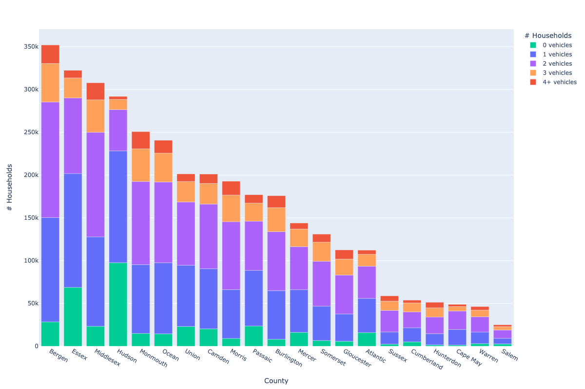
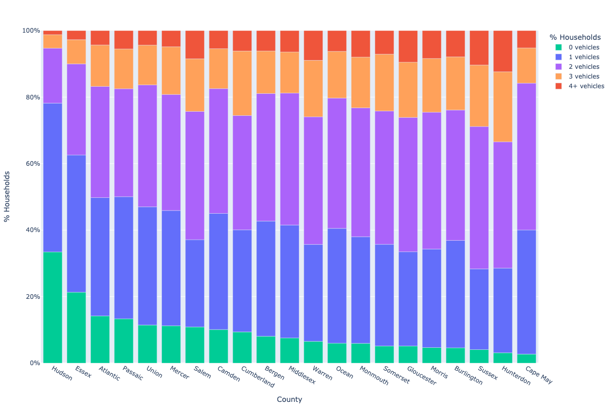
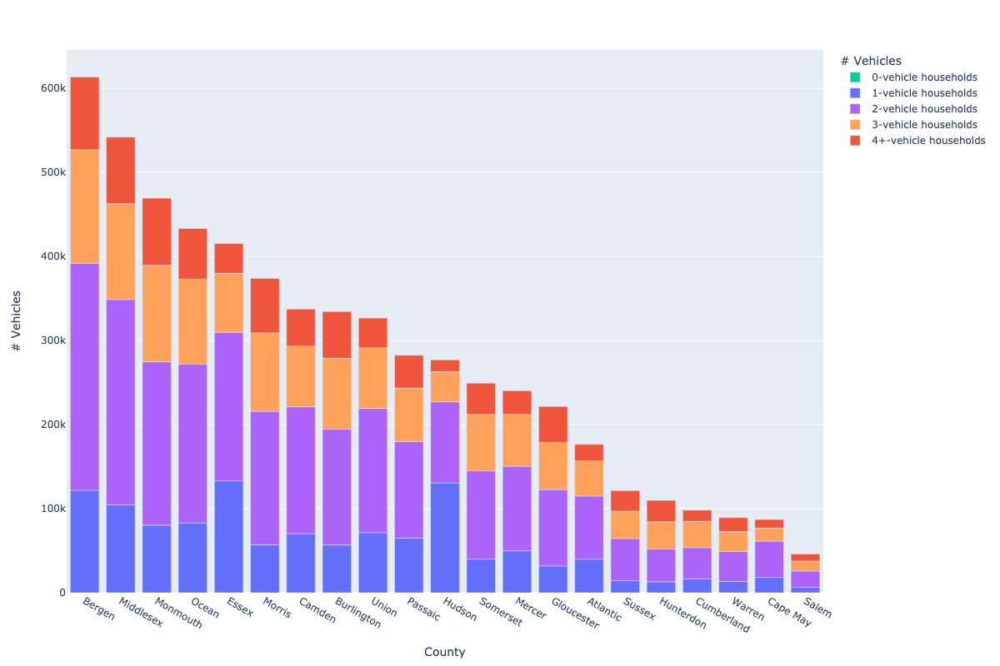
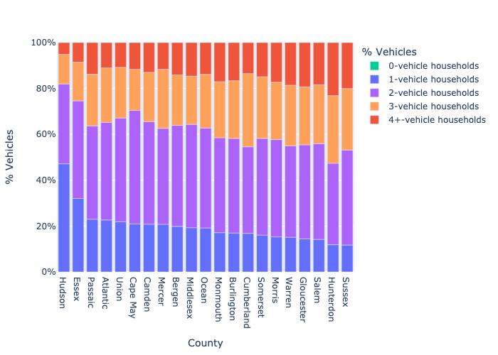

# Vehicles per Household Distributions

## Number of households with 0, 1, 2, 3, or 4+ vehicles, by county (NJ, 2021)

## % of Households with 0, 1, 2, 3, or 4+ Vehicles, by County (NJ, 2021)

## Total vehicles by household vehicle count, per NJ county (NJ, 2021)

## % vehicles by household vehicle count, per county (NJ, 2021)

