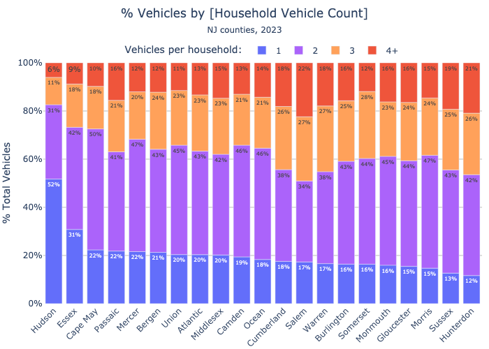
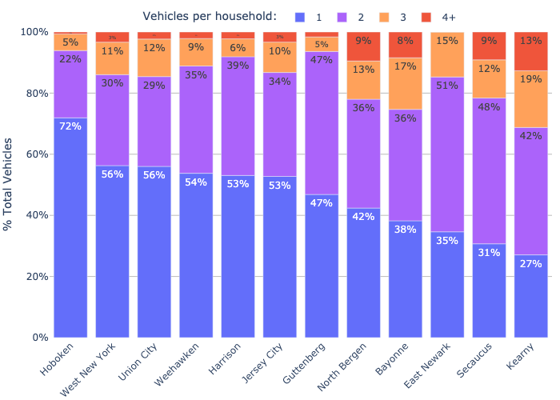
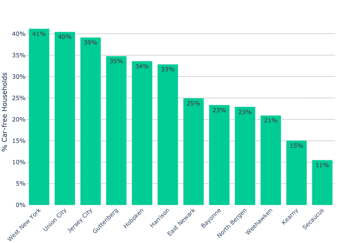

# Vehicles per Household (NJ / Hudson County)
A few analyses of household vehicle counts:
- [NJ (by county)](nj)
- [Hudson County (by city)](hudson)

Data comes from the Census Data API (for NJ) and [censusreporter.org](https://censusreporter.org) (for Hudson County).

Two notable plots / observations:

## % vehicles by household vehicle count (NJ counties) 

In most of the state, ≈80% of the vehicles come from multi-vehicle households! Hudson County is an exception, where it's ≈50%.

There is a huge opportunity for helping families need one fewer car. Replacing one car with an ebike is a popular move, provides the house with a cheaper, cleaner, healthier, and more fun vehicle for many trips.

## % vehicles by household vehicle count (Hudson County municipalities) 

In Hudson County cities (other than Hoboken), 50-75% of the total vehicles come from multi-vehicle households.

## % households with no vehicles (Hudson County cities)

