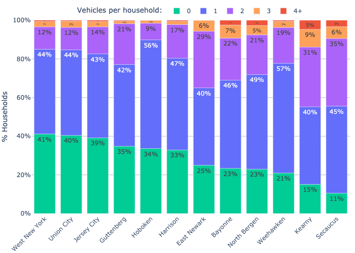

# Vehicles per Household (Hudson County)

[Here's a Google Sheet][gsheet] with the data, and a couple of plots:

Notebook [here](household%20vehicle%20ownership.ipynb), data ([gsheet]) is from ACS 5yr 2021 estimates, from this URL:

https://censusreporter.org/data/table/?table=B08201&geo_ids=16000US3432250,160%7C05000US34017,06000US3401777930,06000US3401752470&primary_geo_id=16000US3432250

## Number of households with 0, 1, 2, 3, or 4+ vehicles, by city 

## % of households with 0, 1, 2, 3, or 4+ vehicles, by city 

Same plot, from [this gsheet][gsheet]:

## Total vehicles by household vehicle count, per Hudson County city 

## % vehicles by household vehicle count, per Hudson County city 

Same plot, from [this gsheet][gsheet]:

One interesting observation from this plot is that, in Hudson County cities other than Hoboken, 50-75% of the total vehicles come from multi-vehicle households.

[gsheet]: https://docs.google.com/spreadsheets/d/1NR-aW8NQTcxVA-60QqsNdPDckyzgsYDcxD5l-9RsaQs/edit
