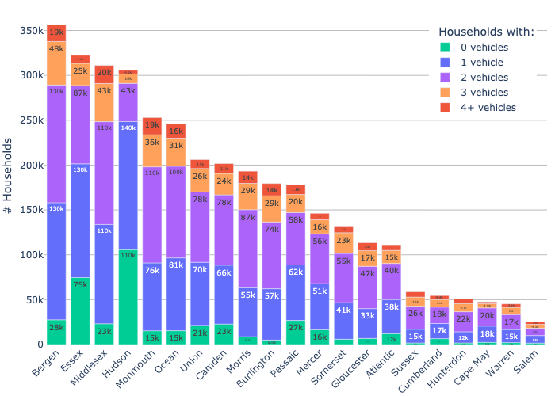
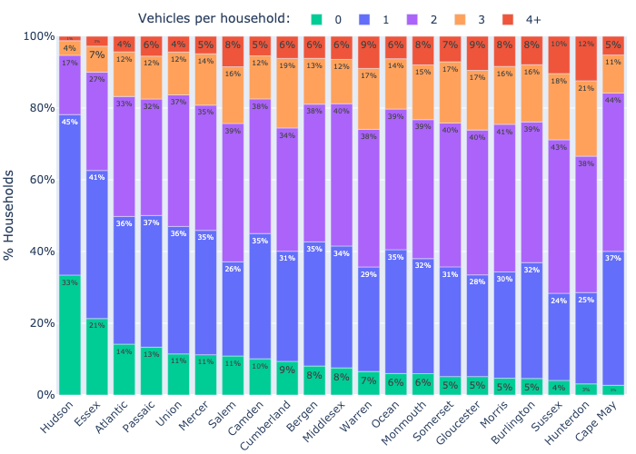
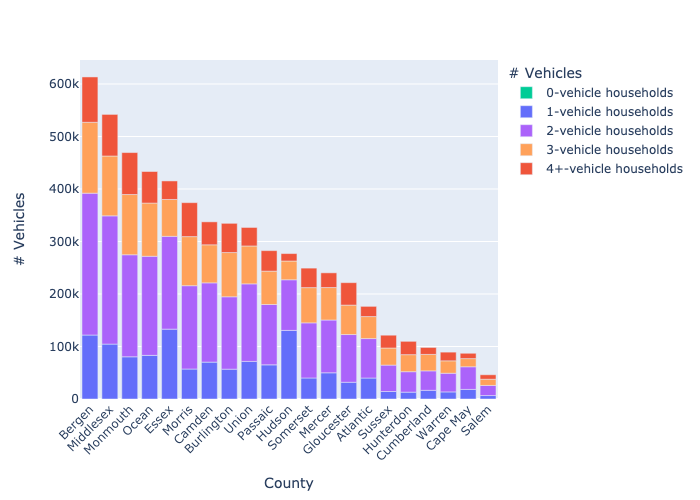
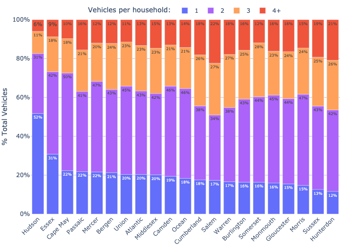

# Vehicles per Household (NJ)

Notebook [here](../nbs/nj.ipynb), data ([csv](vehicles2021.csv), [gsheet](https://docs.google.com/spreadsheets/d/1edtveamM7U8lIngnlFXNOvhaB_6OfMG-gGoJ3VvSqko/edit)) comes from ACS 1yr estimates at this Census Data API URL:

https://api.census.gov/data/2021/acs/acs1?get=NAME,B08201_002E,B08201_003E,B08201_004E,B08201_005E,B08201_006E&for=county:*&in=state:34

## Number of households with 0, 1, 2, 3, or 4+ vehicles, by county 

## % of Households with 0, 1, 2, 3, or 4+ Vehicles, by County 

## Total vehicles by household vehicle count, per NJ county 

## % vehicles by household vehicle count, per county 

In most of the state, ≈80% of the vehicles come from multi-vehicle households! Hudson County is an exception, where it's ≈50%.
